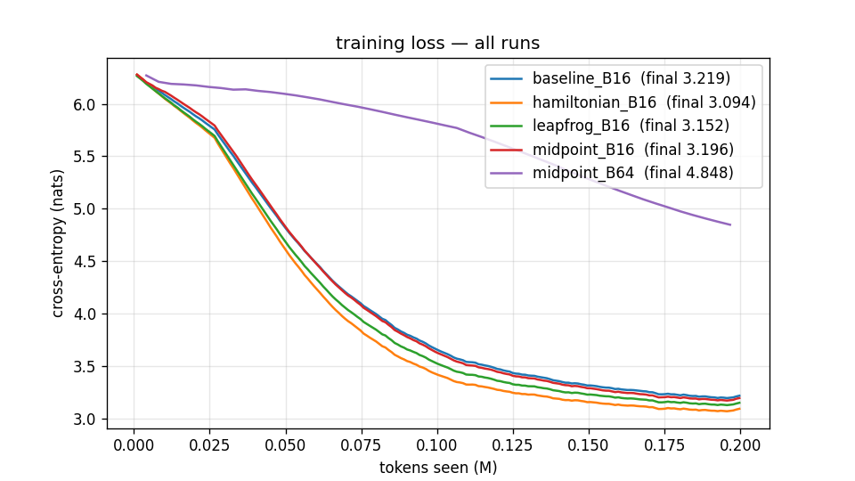

# Reversible LLMs — a hands-on proof of concept

A small, readable re-implementation of **"Reversing Large Language Models for Efficient Training and Fine-Tuning"**
(Gal, Eliasof, Turek, Ascher, Treister, Haber — [arXiv:2512.02056](https://arxiv.org/abs/2512.02056)), plus a set of
Google Colab notebooks that train a ~20M-parameter GPT for 50M tokens four different ways and measure what the paper
promises: **same quality, far less memory, bigger batches, higher throughput.**

> **Status of the numbers in this README.** The code has been verified end-to-end on CPU (exact reversibility, identical
> gradients, constant memory in depth, all four variants train stably — see [§5](#5-what-we-verified-on-cpu-before-spending-gpu-time)).
> The 50M-token TinyStories runs need a GPU; the notebooks are ready to run on a free Colab T4, and notebook `04_report`
> produces the table for [§6](#6-results-50m-tokens-on-gpu). Rows marked `⏳` are filled in from `results/*.json` after you run them.

---

## Table of contents

1. [The paper in plain language](#1-the-paper-in-plain-language)
2. [The paper in slightly more technical language](#2-the-paper-in-slightly-more-technical-language)
3. [What this repo implements](#3-what-this-repo-implements)
4. [How to run the experiments](#4-how-to-run-the-experiments)
5. [What we verified on CPU before spending GPU time](#5-what-we-verified-on-cpu-before-spending-gpu-time)
6. [Results: 50M tokens on GPU](#6-results-50m-tokens-on-gpu)
7. [Findings and gotchas](#7-findings-and-gotchas)
8. [Learnings from a non-ML-engineer perspective](#8-learnings-from-a-non-ml-engineer-perspective)
9. [Repo layout](#9-repo-layout)
10. [Publishing this repo to GitHub](#10-publishing-this-repo-to-github)

---

## 1. The paper in plain language

**The problem.** Training a neural network has two halves. In the *forward* pass the model reads the input layer by layer and
produces a prediction. In the *backward* pass it works out how much every weight contributed to the error, so it can nudge
them. The catch: to do the backward pass, the framework needs to remember what every layer *saw* during the forward pass —
the "activations". For a transformer this is the biggest consumer of GPU memory, and it grows with model depth **and** with
batch size (how many examples you process at once). Memory runs out long before compute does, which forces small batches,
which under-uses the GPU.

**The idea.** What if you didn't have to remember? If each layer's transformation can be *run backwards* — if from a layer's
output you can compute exactly what its input was — then during the backward pass you can simply *reconstruct* the activations
as you go, instead of storing them. Memory for activations stops growing with depth; it becomes a constant.

**Where the trick comes from.** The authors are numerical-analysis people. They notice that a transformer's residual update
`p_next = p + f(p)` looks like one step of a very simple differential-equation solver (forward Euler), which is *not* reversible.
But physics is full of time-reversible processes (waves, orbits), and numerical analysts have known for decades which integration
schemes preserve that reversibility: the **explicit midpoint**, **leapfrog** and **symplectic (Hamiltonian) Euler** methods. The
paper swaps the residual update for one of these schemes. The transformer block `f` itself is untouched — attention and MLP are
exactly what they always were; only the wiring between layers changes.

**The cost.** Reconstructing activations means re-running each layer's forward computation once more during the backward pass.
That's extra arithmetic (they estimate +30–50% per step). The bet is that the freed memory lets you run a much larger batch,
GPUs are more efficient at large batches, and the net effect is *faster* training per token. Their Table 4 shows throughput gains
from +21% (16 layers) to +101% (96 layers).

**Does it hurt the model?** According to their experiments, no — GPT-2 Small/Large trained reversibly reach the same or slightly
better loss and zero-shot accuracy. They also show how to *convert* an already-trained normal model (TinyLlama, SmolLM2) into a
reversible one with a short fine-tune, with ~1 percentage point of accuracy loss.

## 2. The paper in slightly more technical language

Let `f_l(p) = Attn(LN₁(p)) + MLP(LN₂(p + Attn(LN₁(p))))` be a standard pre-norm transformer block (paper eq. 2.5). Then:

| name | layer update | inverse (used in backward) | paper |
|---|---|---|---|
| **baseline** (residual / forward Euler) | `p₍l+1₎ = p₍l₎ + f_l(p₍l₎)` | none — `f` is not invertible | eq. 2.2 |
| **midpoint** | `p₍l+1₎ = p₍l-1₎ + 2h·f_l(p₍l₎)` | `p₍l-1₎ = p₍l+1₎ − 2h·f_l(p₍l₎)` | eq. 2.4 |
| **leapfrog** (2nd-order / wave eq.) | `p₍l+1₎ = 2p₍l₎ − p₍l-1₎ + h²·f_l(p₍l₎)` | `p₍l-1₎ = 2p₍l₎ − p₍l+1₎ + h²·f_l(p₍l₎)` | eq. 2.6 |
| **hamiltonian** (symplectic Euler) | `q₍l₎ = q₍l-1₎ + Attn(LN₁(p₍l-1₎))`; `p₍l₎ = p₍l-1₎ + MLP(LN₂(q₍l₎))` | `p₍l-1₎ = p₍l₎ − MLP(LN₂(q₍l₎))`; `q₍l-1₎ = q₍l₎ − Attn(LN₁(p₍l-1₎))` | eq. 2.8–2.9 |

The reversible schemes are two-step recurrences: the state carried between layers is a *pair* `(p₍l-1₎, p₍l₎)` (or `(p, q)` for
Hamiltonian). Because the newest state depends on `f` evaluated at a state you *still have*, you can always subtract it back out.
That's the whole trick — no matrix inversion, no approximation.

**Memory (§2.2, Fig. 3).** Baseline: activation memory ∝ depth × batch × seq × width. Reversible: only the final pair of states is
stored → constant in depth. Everything else (weights, optimizer state, the output-layer logits) is unchanged.

**Stability (§3).** Reversible recurrences are only *marginally* stable — they neither damp nor amplify, which is exactly what makes
them reversible. The linear analysis `p₍i+1₎ = a·p₍i-1₎ + b·p₍i₎ + hλ·p₍i₎` requires `|a| = 1` and `|b + hλ| ≤ 2` for forward-and-backward
stability, and says the midpoint scheme wants the Jacobian of `f` to have imaginary eigenvalues while leapfrog wants real negative
ones. In practice, pre-LayerNorm inside `f` keeps things bounded and training "just works" at the depths we use. The paper's headline
"Midpoint" results actually use a stochastic variant (eq. 3.6, random per-layer `a`) which behaves like forward Euler in expectation;
we implement the deterministic eq. 2.4 form.

**Retrofitting (§4).** A residual network can be rewritten as an *approximately* reversible two-step recurrence by estimating
`p₍j-1₎ ≈ p₍j₎ − f₍j-1₎(p₍j₎)` (one fixed-point iteration). The approximation is good when `‖∂f‖` is small, which is true of most
trained residual nets, and can be polished by distilling the original model's output distribution (KL) for a couple of epochs.
*Not implemented here* — this POC is about training from scratch.

## 3. What this repo implements

`src/revllm.py` (≈300 lines, heavily commented) contains:

* `Block` — a plain GPT block (causal self-attention via `F.scaled_dot_product_attention`, GELU MLP, pre-LN). Shared by every variant.
* `BaselineLayer`, `MidpointLayer`, `LeapfrogLayer`, `HamiltonianLayer` — the four update rules above. Each reversible layer has a
  `forward(x1, x2) -> (y1, y2)` and an exact `inverse(y1, y2) -> (x1, x2)`.
* `_RevBackprop` — a `torch.autograd.Function` implementing memory-free backpropagation: forward runs under `no_grad` and saves only
  the final `(y1, y2)`; backward walks the layers in reverse, calls `inverse` to get each layer's input, re-runs that one layer with
  autograd on, and back-propagates through it. Peak activation memory = one layer's worth.
* `GPT` — embeddings → layer stack → LayerNorm → tied LM head. `Config(mode=…, rev_backprop=…)` selects the variant and whether to
  use memory-free backward (set `rev_backprop=False` to run the *same* architecture with ordinary autograd — this is how we prove the
  custom backward is exact).
* A **chunked, checkpointed LM head** used by *all* variants. With a 50k-token vocabulary the `(batch·seq) × 50257` logits tensor is
  the single biggest activation in a 20M model; reversibility does nothing about it. Chunking the head keeps that from masking the
  effect we're trying to measure (see [§7](#7-findings-and-gotchas)).
* `SavedTensorMeter` — counts bytes autograd saves for backward via `saved_tensors_hooks`; a platform-independent memory metric.

`src/train.py` — a compact training loop (AdamW, warmup + cosine LR, grad-clipping, fp16 autocast + GradScaler on T4 / bf16 on
Ampere+), that records loss curve, steady-state tokens/s, peak GPU memory and config to JSON; plus `find_max_batch()` which
doubles then binary-searches the largest batch surviving a full forward+backward+optimizer step.

`src/data.py` — streams **TinyStories** from the HF hub, tokenizes with the GPT-2 BPE (`tiktoken`) into `uint16` memmaps (nanoGPT
format); and a no-download synthetic "noisy bigram grammar" for smoke tests.

**The 20M model:** `n_layer=10, n_embd=256, n_head=4, block_size=256, vocab=50257` → **20.8M parameters** (12.9M tied embedding +
0.07M positions + 7.9M in the 10 blocks). Trained for **50M tokens** (≈ 6,100 steps at batch 32 × 256).

## 4. How to run the experiments

> Step-by-step walkthrough (Colab clicks, Drive persistence, resuming after disconnects, bringing results back with Claude Code): **[COLAB_GUIDE.md](COLAB_GUIDE.md)**. Working in Claude Code? It reads **[CLAUDE.md](CLAUDE.md)** automatically.

Open the notebooks in Colab (Runtime → Change runtime type → **T4 GPU**) and run top to bottom. The first cell clones this repo,
so **edit `REPO_URL` in that cell once you've pushed** (or skip it by uploading the `src/` folder).

| notebook | what it does | T4 time |
|---|---|---|
| [`00_sanity_checks.ipynb`](notebooks/00_sanity_checks.ipynb) | exact inverse, identical gradients, memory-vs-depth plot, recompute overhead | ~3 min |
| [`01_baseline_fixed_batch.ipynb`](notebooks/01_baseline_fixed_batch.ipynb) | baseline GPT, **batch 32**, 50M tokens → `results/baseline_B32.json` | ~30–40 min |
| [`02_reversible_variants_fixed_batch.ipynb`](notebooks/02_reversible_variants_fixed_batch.ipynb) | midpoint / leapfrog / hamiltonian at the **same batch 32**, plus the stored-vs-recomputed equivalence check | ~45–55 min each |
| [`03_reversible_max_batch.ipynb`](notebooks/03_reversible_max_batch.ipynb) | probe max batch for baseline & reversible; train reversible at ~90% of its max batch for 50M tokens | ~10 min probe + ~30–45 min |
| [`04_report.ipynb`](notebooks/04_report.ipynb) | collect every `results/*.json` into `results/summary.md` + plots | seconds |

Practical notes:

* Colab free tier disconnects after ~90 min of inactivity or ~12 h total; notebook 02 saves after each variant, so trim `VARIANTS` to resume.
* TinyStories tokenization (55M train + 2M val tokens) takes ~3–5 min the first time and is cached under `data/`. Mount Google Drive and
  point `prepare_tinystories("...drive path...")` if you want it to survive across sessions.
* No GPU? Every notebook auto-switches to `SMOKE` mode (tiny model, synthetic data, ~1 min) — that's how the CPU results below were produced.
  Force it on a GPU with `SMOKE=1` in the environment.
* Reproduce the notebooks from source: `python tools/make_notebooks.py`.

## 5. What we verified on CPU before spending GPU time

All numbers below come from `SMOKE` runs executed in this repo (`results/cpu_smoke/`): 0.86M-param model (4 layers, width 128,
vocab 512, seq 64), 200k tokens of synthetic data, fp32, 4 CPU cores.

**Reversibility is exact and the custom backward is correct** (`00_sanity_checks`):

| variant | loss (rev backprop) | loss (std autograd) | max \|grad diff\| | reconstruction err |
|---|---|---|---|---|
| midpoint | 6.249822 | 6.249822 | 6.0e-08 | 2.0e-07 |
| leapfrog | 6.251880 | 6.251880 | 3.9e-08 | 1.9e-07 |
| hamiltonian | 6.270794 | 6.270794 | 1.3e-08 | 7.1e-08 |

Differences are float32 round-off. A 40-step training run of `midpoint` with stored vs. recomputed activations (same seed) gave a
max loss difference of **1.9e-06** and bit-identical final validation loss (5.2490 vs 5.2490).

**Activation memory is flat in depth** (bytes autograd saves for backward; batch 8 × seq 64, width 128):

| layers | baseline | midpoint (stored) | midpoint (**reversible**) |
|---|---|---|---|
| 2 | 13.4 MB | 13.4 MB | **3.4 MB** |
| 4 | 23.9 MB | 23.9 MB | **3.4 MB** |
| 8 | 45.0 MB | 45.0 MB | **3.4 MB** |

For the real 20M config (width 256, batch 4 × seq 128): baseline 30 → 55 → 103 → 199 MB at 2/4/8/16 layers; reversible **7.2 MB at every depth**.
The 3.4 / 7.2 MB floor is the embedding lookup + final pair of states + LM head — the parts that aren't inside the reversible stack.

**Recompute overhead on CPU:** +67–70% step time for all three variants (CPU has no tensor cores, so the extra forward is relatively
expensive; the paper's 30–50% GPU estimate is what notebook 00 measures on T4).

**All four variants train, and stably** (200k tokens, batch 16, lr 2e-3):

| run | train loss | val loss | tokens/s (CPU) |
|---|---|---|---|
| baseline_B16 | 3.2174 | 3.2349 | 29,460 |
| midpoint_B16 | 3.1936 | 3.2062 | 17,160 |
| leapfrog_B16 | 3.1499 | 3.1676 | 17,097 |
| hamiltonian_B16 | **3.0933** | **3.1153** | 17,291 |
| midpoint_B64 (4× batch, same tokens → 4× fewer steps) | 4.7508 | 4.5789 | 18,048 |



Two things worth noticing even at toy scale: the reversible variants are *not worse* than the baseline (Hamiltonian is best here,
matching the paper's "comparable or improved" claim), and the max-batch run is dramatically *worse* at a fixed token budget because
it only got 48 optimizer steps instead of 195. That second point is the most important caveat in the whole paper — see §7.

## 6. Results: 50M tokens on GPU

> ⏳ **Fill in after running notebooks 01–04 on Colab.** `04_report.ipynb` writes exactly this table to `results/summary.md`; paste it here.
> Commit the `results/*.json` and `.png` files too so the numbers are reproducible.

**Setup:** NVIDIA T4 (15 GB), fp16 autocast, 20.8M params, TinyStories (GPT-2 BPE), 50M tokens per run, AdamW (β=0.9/0.95, wd 0.1),
3% warmup + cosine to 10%, grad-clip 1.0, no dropout.

### 6.1 Fixed batch = 32 × 256 tokens (≈6,100 steps)

| run | final train loss | final val loss | tokens/s | peak GB | wall-clock |
|---|---|---|---|---|---|
| baseline_B32 | ⏳ | ⏳ | ⏳ | ⏳ | ⏳ |
| midpoint_B32 (reversible) | ⏳ | ⏳ | ⏳ | ⏳ | ⏳ |
| leapfrog_B32 (reversible) | ⏳ | ⏳ | ⏳ | ⏳ | ⏳ |
| hamiltonian_B32 (reversible) | ⏳ | ⏳ | ⏳ | ⏳ | ⏳ |

*Which variant worked best:* ⏳ (from the CPU smoke run: Hamiltonian > Leapfrog > Midpoint ≈ Baseline; the GPU run decides.)

### 6.2 Maximum batch that fits (T4, 15 GB)

| model | max batch | peak GB at max | vs baseline |
|---|---|---|---|
| baseline | ⏳ | ⏳ | 1.0× |
| midpoint (stored activations) | ⏳ | ⏳ | ⏳ |
| midpoint (**reversible**) | ⏳ | ⏳ | ⏳ |

### 6.3 Reversible at max batch, same 50M tokens

| run | batch | steps | final train loss | final val loss | tokens/s | peak GB | wall-clock |
|---|---|---|---|---|---|---|---|
| midpoint_maxbatch_B⏳ | ⏳ | ⏳ | ⏳ | ⏳ | ⏳ | ⏳ | ⏳ |

Expected shape of the result, based on the paper and the CPU dry run: tokens/s **up** (paper: +20% at 16 layers), peak memory near the
card's limit by construction, and final loss **worse** than the batch-32 run because 50M tokens at a huge batch is far fewer optimizer
steps. Throughput and sample-efficiency pull in opposite directions; the paper's Table 4 measures only the first.

## 7. Findings and gotchas

**1. The reversible backward is genuinely exact, not approximate.** Gradient differences of 1e-8 and bit-identical loss curves. There is
no "reversibility error" to tune away, unlike activation-checkpointing schemes that recompute with dropout RNG etc. (We disable dropout;
with dropout you'd need to replay RNG state in the inverse, as Reformer does.)

**2. Memory really is flat in depth — but only for the transformer stack.** In a 20M model with a 50,257-token vocabulary, the LM head's
logits (`batch·seq × 50257 × 2 bytes`) are bigger than all the block activations combined. Without the chunked head, "max batch" is set by
the logits for *both* baseline and reversible, and the paper's 10× disappears. This is not a flaw in the paper — GPT-2 Small has 12× more
per-layer activation than our model — but it's the first thing you hit at POC scale. Deeper/wider models make the effect larger; a big
vocabulary on a tiny model makes it smaller.

**3. Recompute overhead is real: +67–70% on CPU, expected +30–50% on GPU.** At a *fixed* batch size the reversible model is strictly
slower per token. The win only appears when you *use* the freed memory for a bigger batch — and only if the GPU wasn't already saturated
at the small batch. On a T4 with a 20M model, batch 32 × 256 = 8k tokens/step probably already keeps the GPU fairly busy, so the
throughput gain will be modest (the paper's 16-layer row shows +21%; their +101% is at 96 layers).

**4. Big batch ≠ better model for the same tokens.** Our 4×-batch smoke run got 4× fewer optimizer steps and a far worse loss. At scale
you'd counter this with a higher learning rate (we use √-scaling), more tokens, or a batch-size warmup schedule. "Same tokens, bigger
batch, faster" is a throughput claim, not a quality claim — read Table 4 of the paper with that in mind.

**5. The three schemes behave differently at initialization.** Midpoint with `2h = 1` matches the baseline's residual scale exactly;
leapfrog with `h = 1` has an accumulating "velocity" term (`2p₍l₎ − p₍l-1₎`) so hidden-state norms grow roughly quadratically with depth
before LayerNorm tames them; Hamiltonian splits attention and MLP onto two streams, so each stream sees half the updates. At 10 layers all
three are stable with GPT-2 init; at 50+ layers you would want to think about `h`.

**6. Variant ranking at toy scale: Hamiltonian > Leapfrog > Midpoint ≈ Baseline.** Consistent with the paper's finding that leapfrog is
"more stable" and with the intuition that second-order schemes propagate information further. Whether this survives at 20M/50M tokens is
what notebook 02 answers.

**7. Things we did not do.** No retrofit/conversion of a pre-trained model (§4 of the paper); no stochastic midpoint-θ (eq. 3.6); no
downstream benchmarks (PIQA etc. are meaningless for a 20M TinyStories model); single seed per run.

## 8. Learnings from a non-ML-engineer perspective

**The GPU's memory is the wall, not its speed.** Everyone talks about FLOPs, but the practical limit on "how big a step can I take" is
how much the card can hold at once. The paper attacks memory and gets speed as a side-effect. Same pattern as many engineering wins:
remove the bottleneck you didn't know you had.

**"Remember everything" vs. "be able to recompute anything" is a classic trade-off.** It's the same choice as caching vs. recomputing in
software, or keeping receipts vs. being able to reconstruct a ledger. Reversible networks are the "reconstruct it" option, and the paper's
contribution is noticing that a 50-year-old numerical-analysis trick gives you *exact* reconstruction for free.

**A neural network is a dynamical system.** The layers of a transformer are "time steps"; the hidden state is a particle moving through
space. Once you see it that way, you can borrow the entire toolbox physicists use for simulating orbits and waves — including which
step rules can be run backwards. Small change in perspective, large practical payoff.

**Small changes to wiring, not to the parts.** The attention and MLP inside each block are untouched. Only the "plus" between layers is
replaced with a slightly different "plus". That's why an existing model can be converted, and why this is not a new architecture so much
as a new *training recipe*.

**Claims need a control group.** The most convincing test in this repo isn't the training run — it's running the *same* reversible
architecture with and without the memory-free backward and getting identical losses to 6 decimal places. When you're told a method
"doesn't change the math", ask how that was checked.

**Faster ≠ better.** Doubling throughput with a bigger batch while keeping the token budget fixed means fewer learning steps, and that can
hurt quality badly (our 4×-batch run was much worse). Speed metrics and quality metrics must be read together; a table that shows only
tokens/s is telling half the story.

**Where the memory actually goes surprised us.** In a small model the output vocabulary layer, not the "deep" part, dominated memory. You
often need to measure before you can tell which optimization will matter for *your* case — the paper's 10× is real for GPT-2-sized models
and would be invisible on ours without an extra trick.

**Compute is cheap, memory is expensive, and both are cheaper than researcher time.** The reversible model does ~1.5× the arithmetic per
step and the authors consider that a good deal. In production ML, trading compute for memory (or for simplicity) is normal and often right.

**Free-tier hardware is enough to *understand* a paper, not to *reproduce* it.** Our 20M model on a T4 shows every qualitative effect —
exactness, flat memory, overhead, batch scaling — but the impressive 10×/+101% headline numbers need 100M+ parameter, 96-layer models on
80 GB cards. Knowing which conclusions transfer from toy scale (mechanisms) and which don't (magnitudes) is most of the skill.

## 9. Repo layout

```
reversible-llm-poc/
├── README.md
├── CLAUDE.md             # instructions for Claude Code (invariants, commands, common tasks)
├── COLAB_GUIDE.md        # click-by-click guide to running on Colab
├── requirements.txt
├── src/
│   ├── revllm.py        # model, 4 update rules, memory-free autograd Function, chunked head, SavedTensorMeter
│   ├── train.py         # train(...) -> results dict/JSON, find_max_batch(...)
│   └── data.py          # TinyStories -> uint16 memmap; synthetic smoke data; TokenStream
├── notebooks/
│   ├── 00_sanity_checks.ipynb
│   ├── 01_baseline_fixed_batch.ipynb
│   ├── 02_reversible_variants_fixed_batch.ipynb
│   ├── 03_reversible_max_batch.ipynb
│   └── 04_report.ipynb
├── tools/make_notebooks.py   # notebooks are generated from this (diff-friendly source of truth)
└── results/
    ├── cpu_smoke/            # executed CPU smoke results + plots + executed 00 notebook
    └── *.json / *.png        # <- your GPU runs land here
```

## 10. Publishing this repo to GitHub

```bash
cd reversible-llm-poc
git init -b main
git add -A
git commit -m "Reversible LLM POC: midpoint / leapfrog / hamiltonian vs baseline, Colab notebooks"
# create an empty repo on GitHub named reversible-llm-poc, then:
git remote add origin https://github.com/<your-user>/reversible-llm-poc.git
git push -u origin main
```

Then edit `REPO_URL` in the first cell of each notebook (or in `tools/make_notebooks.py` and regenerate), and open a notebook in Colab via
`https://colab.research.google.com/github/<your-user>/reversible-llm-poc/blob/main/notebooks/01_baseline_fixed_batch.ipynb`.
After the runs finish, download `results.zip` from notebook 04, unzip into `results/`, paste `results/summary.md` into §6, and commit.

## References

* E. Gal, M. Eliasof, J. Turek, U. Ascher, E. Treister, E. Haber. *Reversing Large Language Models for Efficient Training and Fine-Tuning.* arXiv:2512.02056, 2025.
* N. Kitaev, Ł. Kaiser, A. Levskaya. *Reformer: The Efficient Transformer.* ICLR 2020 — reversible layers for LMs (the Hamiltonian-style two-stream idea).
* K. Mangalam et al. *Reversible Vision Transformers.* CVPR 2022 — the `_RevBackprop`-style custom autograd pattern used here.
* E. Haber, L. Ruthotto. *Stable architectures for deep neural networks.* Inverse Problems, 2017 — networks as discretized ODEs.
* A. Karpathy. *nanoGPT* — the model/training-loop conventions (init, AdamW groups, memmap data format) this code follows.
